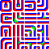
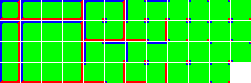

# RWEditor
A rain world level editor remade from the ground up with javascript and html/css. link to my editor: https://rweditor.net

# to do things
* click left mouse to use the currently selected tool
* click and hold middle mouse to move the view

# material format

## in **materials.json**
```javascript
{
	"materialName" : {													//the only requirement for the material name is that it's different from every other name in the json file
		"baseSize" : 20, 													//the base size of each asset in pixels. this is used to split the big textures you make into a bunch of small ones i can use
		"variants" : 2,														//the number of unique versions of the same tile. in the editor you can choose a specific variant or a random one
		"layers" : 2,															//the number of unique layer textures you are using for the material
		"type" : "tile",													//the type of the material. see below for all supported material types
		"wall" : [2, 2, 2, 2, 2, 2, 2, 2, 2, 2]		//the layout for each layer of the material. a tile is always made of 10 layers. see below for what each number means in this
	}
}
```

## layers
* each number represents which texture to use for that layer of the material
* 2 textures are provided to every material by default. texture 0 is just an invisible texture to be used as padding, and texture 1 is a green texture in the shape of the geometry you've selected
* every texture after 1 (so 2-infinity) are textures that you added manually to the material with the ``layers``` attribute
* the main geometry types are : wall, slope, semisolid platform, and pole. to edit the layer setup for them just add an entry to the material that is called the geometry type you wanna edit

## material types
{TODO: a more complete tutorial on material creation}
### tile 
* a simple tile that doesn't connect to any of its neighbors

### simpleConnected
* a tile which will care about its four directly adjacent neighbors and connect with them. make sure to lay out the textures properly using the provided templates
* to add more layers, just duplicate this texture downwards with whatever variations you want for that other layer, and importantly there must be a 1 pixel gap between all individual textures as well as between each layer


### complexConnected
* a tile which will care about all 8 neighboring tiles. again make sure to lay out the texture correctly using the correct template below
* the method to add more layers to this is the same as above


### mask
* (not currently implemented) uses green areas of the ``baseMaterial``` material to act as an area to "allow" a desired texture to show through

### random
* (not currently implemented) a tile which will place down randomized sprites taken from a big texture, roughly within the area of the tile the material was added to


# How to use the editor
## General
To get a blank level, refresh the page

# where to get the original editor and its project files
the basegame's project files and original editor can be found at the bottom of this page: https://store.steampowered.com/news/app/312520/view/3671033323706467799

The project files for the game itself are located at *\Official Level Editor Downpour\LevelEditorProjects\World
